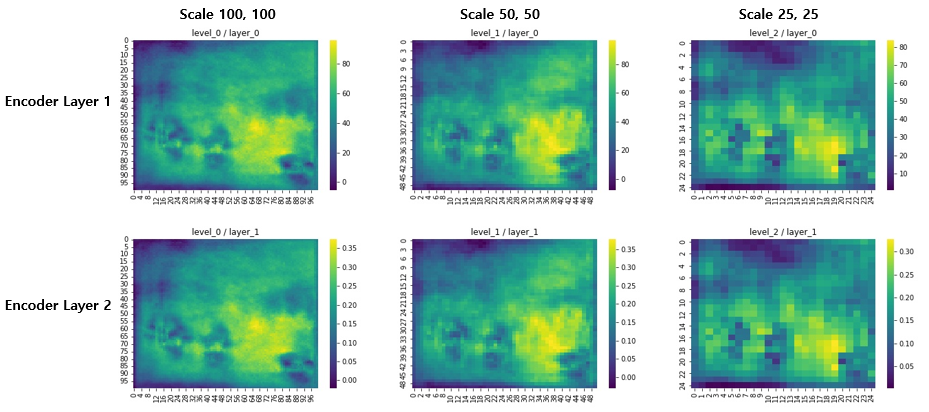
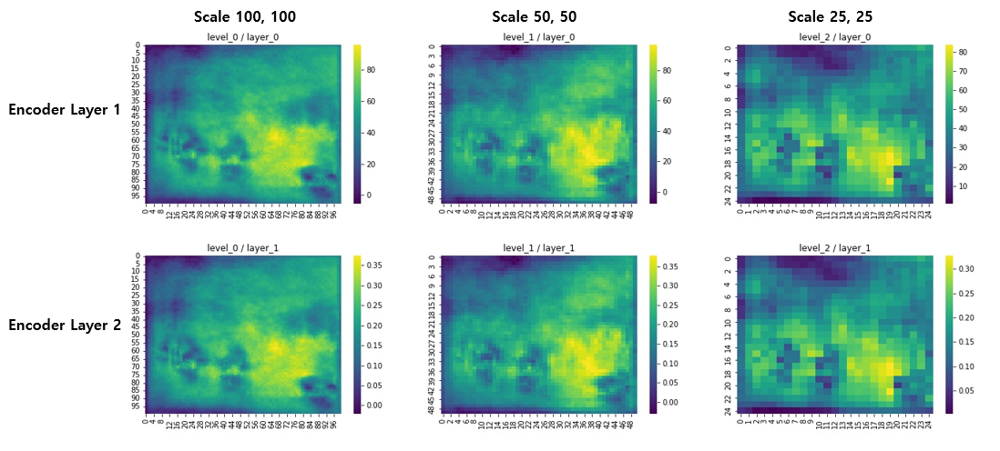
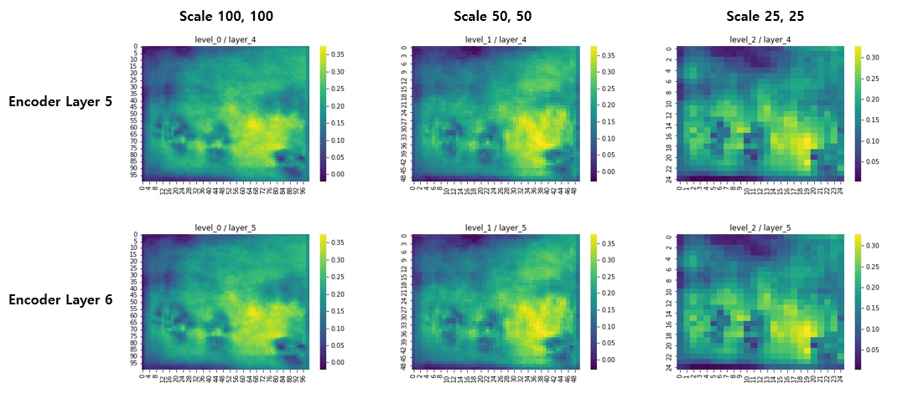
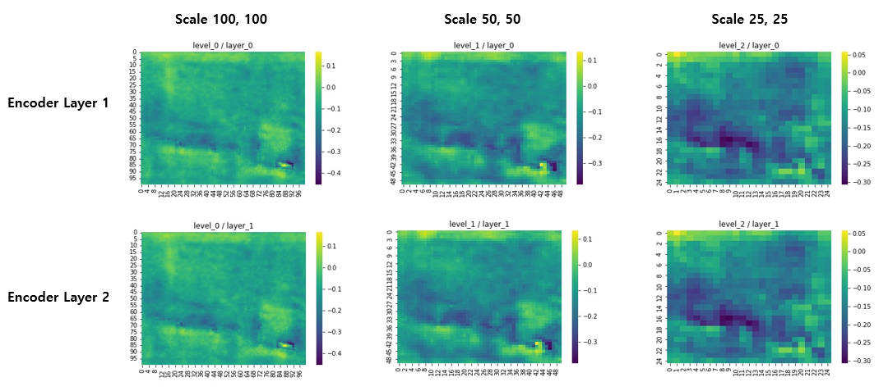
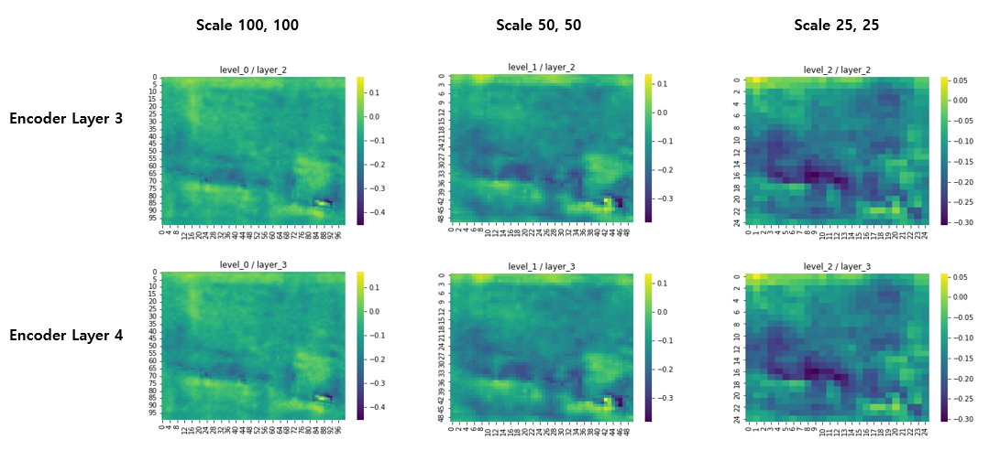
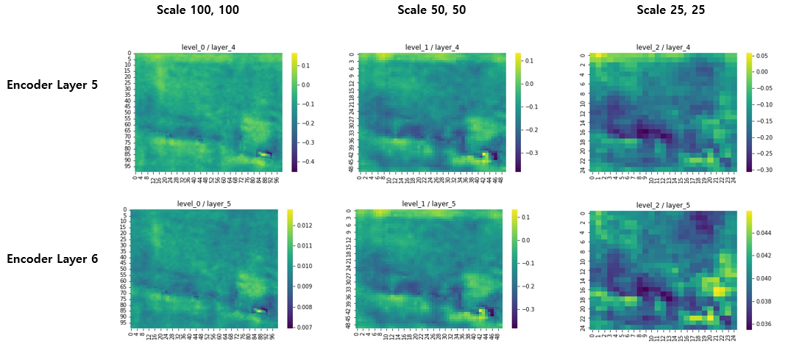
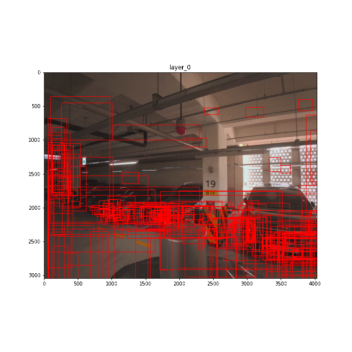

# Deformable DETR

By [Xizhou Zhu](https://scholar.google.com/citations?user=02RXI00AAAAJ),  [Weijie Su](https://www.weijiesu.com/),  [Lewei Lu](https://www.linkedin.com/in/lewei-lu-94015977/), [Bin Li](http://staff.ustc.edu.cn/~binli/), [Xiaogang Wang](http://www.ee.cuhk.edu.hk/~xgwang/), [Jifeng Dai](https://jifengdai.org/).

This repository is an official implementation of the paper [Deformable DETR: Deformable Transformers for End-to-End Object Detection](https://arxiv.org/abs/2010.04159).

**It was prepared by referring to the Deformable DETR model in the link below.**
https://github.com/fundamentalvision/Deformable-DETR

## Abstract 
- 시각화 관련 코드는 detr_hands_on_custom.ipnyb로 구현되어 있음
- Faster_RCNN의 코드가 존재하는 이유는 원래 Faster_RCNN으로부터 차량의 Region Proposals을 받아 object query로 넣어주는 테스트를 진행중이였기에 존재함으로 활용해도 무관함  
- 본 코드는 차량 번호판 탐지를 기반으로 했기에 만약 다른 클래스의 Attention, Sampling Point, Reference Point를 확인하려면 수정이 필요함

## Attention Visualizer Result(Encoder)
### Deformable DETER Encoder Attention

### Deformable DETER(use Two-Stage) Encoder Attention

## ReferencePoint Visualizer 
  

## Inference without Annontations
inference_withoutAnn.py를 참고